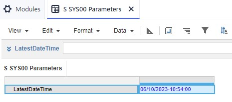

# Current Date and Time in Anaplan

## Overview
Anaplan doesn't have a concept of current date and time.
A way around this is to upddate a line item using the Anaplan API on a periodic basis with what you want the current date and time to be. 
If you want any further information on this or would want some help setting this up, get in touch and I will take you through it. 

## Applications
Some new functionality will be possible if you have the current date and time in Anaplan.

1. Log the date and time when actions are run. To let you see how uptodate modules downstream from actions are.
2. If you want to create snapshots of modules at specific times, the current way of doing this is to manually enter unique keys for the snapshots. The current date and time can replace this. 

## Setup
I've tried to make this setup as non-technical as possible but it does require some knowledge of the command line and maybe some familiarity with git and Python libraries to know what's happening. 

1. Either download or pull the files from this repository into a directory.

```commandline
git init
git pull https://github.com/klameer/Anaplan-Clock.git main
```

2. In Anaplan create a module and line item to hold the date time string.
   * The line item name is set to be LatestDateTime and is in Text format. 


3. Create an action that updates this from a csv file and get the associated File and Process Ids.
4. In the .env file update all the variables. You can also set the timezone.

5. Install the necessary libraries.
```commandline
pip -r requirements.txt 
```

5. Run the script
```commandline
python main.py
```

## Automating the Process
This script can live on your local machine or within a cloud service. I have used AWS Lambda and Google Cloud Functions. Once installed, you can run a scheduling service, if local as a chron job or also as a cloud service as AWS EventBridge or Google Cloud Scheduler. This can beset to run every minute. 

