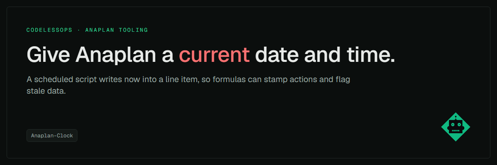
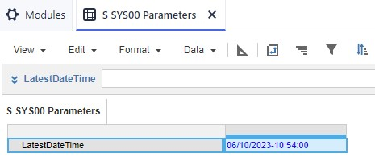

# Anaplan-Clock

Give Anaplan a current date and time. A small scheduled script writes "now" into a line item every minute, so formulas can know what day it is.



## Why I built it

Anaplan has no concept of the current date and time. The model has a current period, set by hand, and that's all. Anything that needs the real clock, like stamping when an action ran or telling a user their data is three days old, has to be typed in.

The fix is small. Push a timestamp in by API on a schedule. This repo is that push, packaged so it runs locally, as a cron job, or as a cloud function.

## What it unlocks

- Action timestamps. Copy `LatestDateTime` into a log line item as the last step of a process, and every downstream module can show when it was loaded.
- Staleness flags. `IF Loaded Date < Latest Date - 1 THEN "Stale" ELSE "OK"` on a dashboard.
- Snapshot keys. Key a scenario snapshot on the timestamp instead of asking users to invent unique names.
- Working-day logic. Compare the real date with the model's current period and warn when someone is still editing last month.

## How it works

1. Authenticate to the Anaplan v2 API
2. `PUT` a two-line CSV (`LatestDateTime,20/09/2026-09:42:15`) to a file in the model
3. Run the process that imports that file into the line item
4. Log out

Timezone is configurable. The timestamp is text in `dd/mm/yyyy-HH:MM:SS` form, which you convert with `DATE` and `TEXT` functions in the model.

## Setup

In Anaplan:

1. Create a module with one Text line item called `LatestDateTime`.
2. Create an import action from a CSV file into that line item and wrap it in a process. Note the file ID and process ID (from the API or the URL).

Locally:

```bash
git clone https://github.com/klameer/Anaplan-Clock.git
cd Anaplan-Clock
pip install -r requirements.txt
```

Fill in `.env`:

```
user=you@company.com
password=...
workspaceId=...
modelId=...
fileId=...
processId=...
timezone=Europe/London
```

Then:

```bash
python main.py
```

You should see `20/09/2026-09:42:15 Updated` and the line item change in the model.

## Scheduling it

- Local: cron or Windows Task Scheduler, every minute or every five.
- Google Cloud Functions: deploy the folder as is. `main.py` already exposes `run(request)` as the HTTP entry point. Trigger it from Cloud Scheduler.
- AWS Lambda: same code, point the handler at `run`, trigger from EventBridge.

Keep the credentials in the platform's secret manager rather than shipping the `.env`.

## Notes

- Each run is one file upload plus one process run, so it's cheap on API calls.
- Basic auth, for readability. Swap `get_auth_token` for certificate auth in production.
- Built on the same functions as [anaplan-api-starter](https://github.com/klameer/anaplan-api-starter).

MIT licensed. I'm [Karim Lameer](https://www.linkedin.com/in/karimlameer), Master Anaplanner and CIMA-qualified accountant. I write about this at [codelessops.com](https://codelessops.com).
